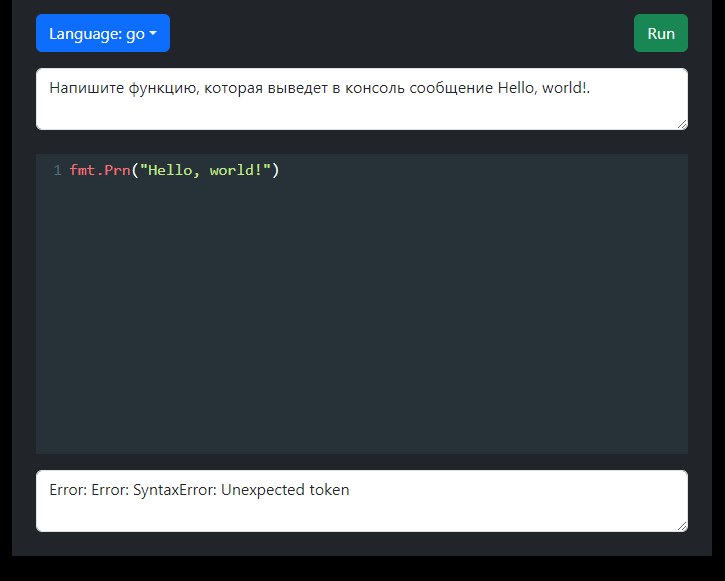

# ToDo-App

Это проект редактор кода.

## Скриншот

Ниже приведён скриншот приложения и какие моковые запросы вернут положительный результат, и какие отрицательный:




## Запуск проекта

Вы можете запустить проект двумя способами:

### Способ 1: Запуск через Node.js

1. Перейдите в директорию и запустить:
   ```bash
   npm run i &&cd client &&npm run dev
   
2. Перейти по ссылке http://localhost:3000/

### Способ 2: Запуск через Docker

1. В корне проекта наберите это:
   ```bash
   npm run docker:docker:codeEditor-dev

2. Перейти по ссылке http://localhost:3000/
